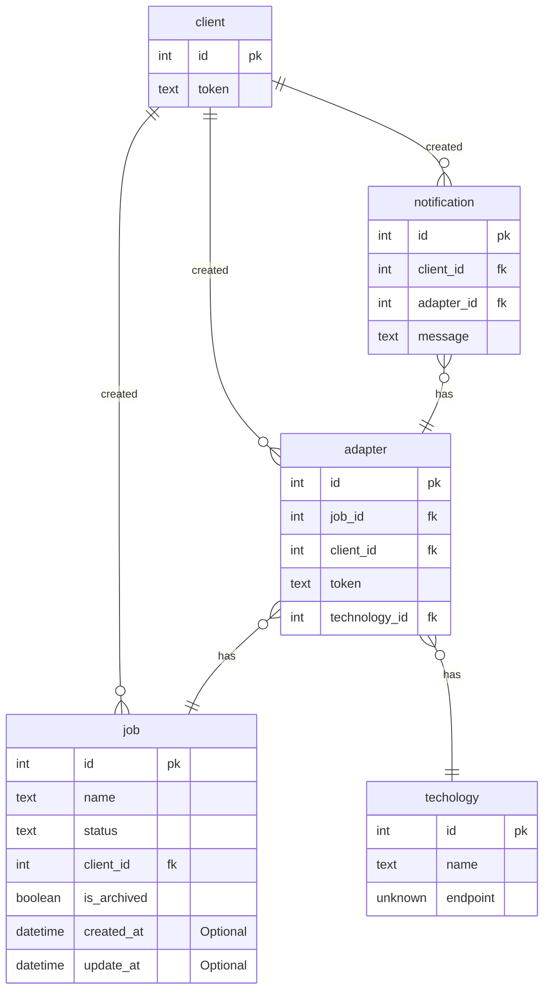

```mermaid
erDiagram
client{
    int id pk
    text token
}
job{
    int id pk
    text name
    text status
    int client_id fk
    boolean is_archived
    datetime created_at "Optional"
    datetime update_at "Optional"
}
adapter{
    int id pk
    int job_id fk
    int client_id fk
    text token
    int technology_id fk
}
notification{
    int id pk
    int client_id fk
    int adapter_id fk
    text message
}
techology {
    int id pk
    text name
    unknown endpoint
}
adapter o{--|| job : has
notification o{--|| adapter : has

adapter o{--|| techology : has

client ||--}o job : created
client ||--}o adapter: created
client ||--}o notification: created

```
