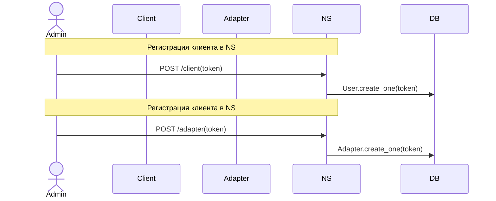
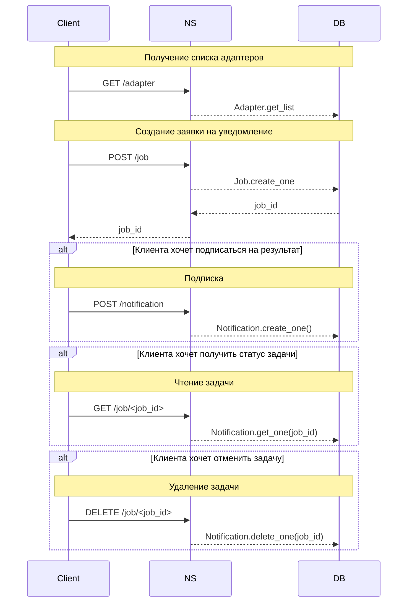
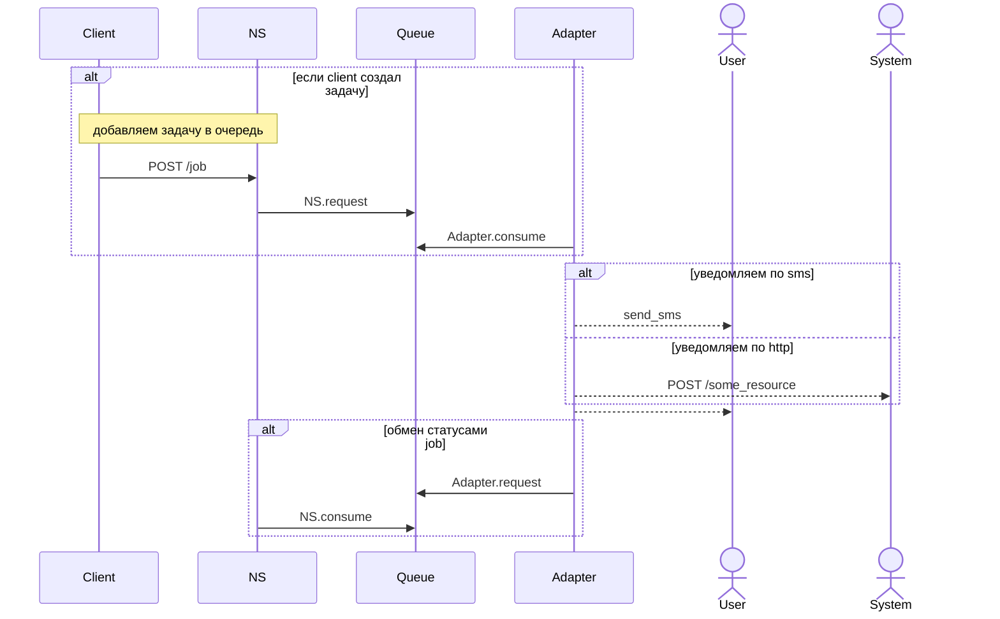
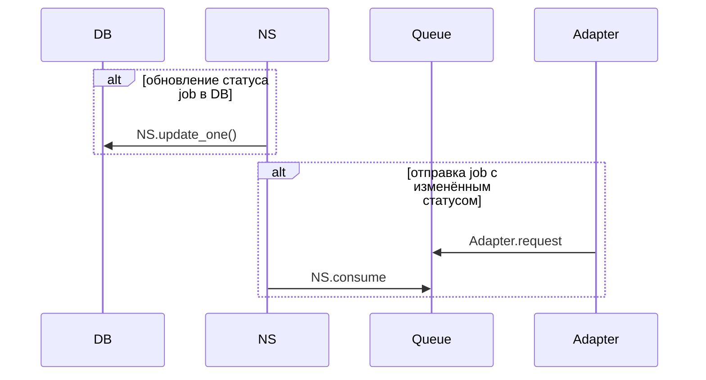

### Регистрация и авторизация клиента и адаптера

___
### Каждый клиент может получить список адаптеров, доступных для уведомлений

___

### Взаимеодействие с адаптерами

___

### Изменение статуса job
